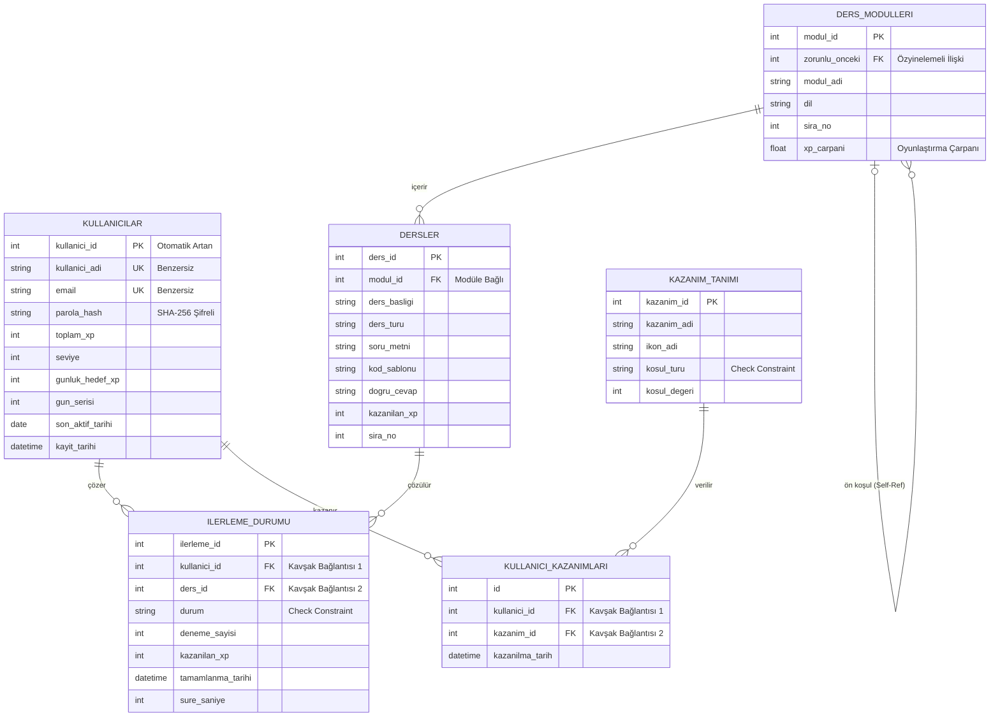

# Yazilimgo_Python: Oyunlaştırılmış Kodlama Eğitmeni
İleri Programlama dersi için, programlama öğrenme sürecini oyunlaştırılmış interaktif testler, performans analizleri ve görsel öğrenme eğrileri ile destekleyen bir masaüstü eğitim platformudur. Öğretim tasarımı ilkelerine uygun düzenlenmiştir. 

## 🏗 Mimari Deseni (Architectural Pattern)
Proje, modülerlik ve sürdürülebilirlik için **N-Tier (Katmanlı Mimari)** yapısını kullanır:
* **Presentation (Tkinter & Matplotlib):** Kullanıcı dostu arayüz ve analiz grafiklerini sunar.
* **Business (BLL):** Soru mantığı, XP/Level hesaplamaları ve **NumPy** tabanlı başarı analizlerini yönetir.
* **DAL (Data Access):** SQLite üzerinden veritabanı işlemlerini koordine eder.
* **Core:** Tüm katmanlar için merkezi doğrulama (Validation) sağlar.

* ## 🛠 Kullanılan Teknolojiler & Tasarım Desenleri
* **NumPy:** Öğrenci hata oranları ve gelişim verilerinin matris tabanlı matematiksel analizi.
* **Matplotlib:** Öğrenme eğrilerinin ve başarı istatistiklerinin görselleştirilmesi.
* **SQLite:** Veri kalıcılığı ve ilişkisel veritabanı yönetimi.
* **Singleton Pattern:** Veritabanı bağlantısında tekil nesne yönetimi.
* **Strategy Pattern:** Farklı zorluk seviyelerine göre puan hesaplama algoritmaları.

```markdown
## 🗺️ Veritabanı Mimarisi (ER Şeması)
